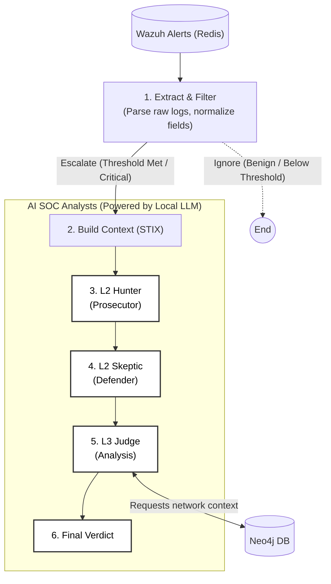

# SOC AI Analyst

Magister is an advanced, automated Security Operations Center (SOC) Analyst powered by Local Large Language Models (LLMs) and built on top of [LangGraph](https://github.com/langchain-ai/langgraph). It ingests security alerts from Wazuh via Redis, standardizes them into STIX 2.1 format, and utilizes a multi-agent debate system (Hunter vs. Skeptic) enriched with Neo4j network topology context to reach highly accurate, autonomous verdicts on potential security incidents.

---

## Key Features

- **Automated Alert Ingestion & Triage:** Connects to a Redis queue (`wazuh_raw_alerts`) to continuously process, deduplicate, and archive high-volume raw JSON alerts from Wazuh.
- **Multi-Agent Reasoning (LangGraph):** Uses a sophisticated graph of AI agents (L2 Hunter, L2 Skeptic, and L3 Judge) that debate the nature of an alert to prevent false positives and identify complex attack chains.
- **Network Context Awareness:** Integrates with a **Neo4j Graph Database** that maps your network topology (zones, servers, services, and user privileges). The L3 Judge queries this database to understand lateral movement possibilities before reaching a final verdict.
- **Cyber Threat Intelligence (STIX 2.1):** Automatically converts raw, disparate Wazuh logs into standardized STIX 2.1 bundles (`Identity`, `IPv4Address`, `ObservedData`), ensuring interoperability and structured reasoning.
- **Privacy-First Local AI:** Fully compatible with Local LLMs via **Ollama** (e.g., `llama3.1:8b`), ensuring sensitive security logs never leave your infrastructure.

---

## Architecture



### How the Pipeline Works

1. **Extraction & Filtering (`src/data_pipeline/deduplication.py` & `src/brain/nodes.py`)**: 
   Continuously polls Redis for new Wazuh alerts. Alerts are parsed, deduplicated (using a 5-minute rolling window), and archived in Redis Sorted Sets. Critical alerts (Rule Level >= 10) trigger an immediate escalation.
2. **Context Aggregation (`src/data_pipeline/STIX_conversion.py`)**:
   Escalated alerts and historical logs are converted into a standardized STIX 2.1 graph, creating a comprehensive picture of the target system (`Identity`), the event (`ObservedData`), and network indicators.
3. **L2 Hunter Agent (Prosecutor)**:
   Analyzes the STIX context to build a hypothesis of an ongoing attack. It actively looks for malicious intent and maps findings to MITRE ATT&CK tactics.
4. **L2 Skeptic Agent (Defender)**:
   Critiques the Hunter's theory. It attempts to find benign explanations, system misconfigurations, or false positives that could explain the alerts.
5. **L3 Judge Agent (Final Verdict) & Graph Memory**:
   The Judge reviews the debate. Before rendering a verdict, it uses custom tools (`src/brain/tools.py`) to query the **Neo4j Network Topology** (`src/neo4j/app.py`). By understanding what services run on the compromised host and what lateral movement paths exist, it makes a definitive, context-aware decision.

---

## Repository Structure

```text
├── src/
│   ├── brain/              # LangGraph AI agent logic, state management, and tools
│   │   ├── nodes.py        # Core agent execution nodes (Hunter, Skeptic, Judge)
│   │   ├── graph.py        # LangGraph routing and state construction
│   │   ├── state.py        # TypedDict defining data passed between agents
│   │   ├── config.py       # Global environment and client configurations
│   │   └── visualize.py    # Utility to render the LangGraph architecture as a PNG
│   ├── data_pipeline/      # Redis queue processing, deduplication, STIX conversion
│   │   ├── deduplication.py# Redis polling and log archival logic
│   │   └── STIX_conversion.py # Transforms Wazuh JSON into STIX 2.1 format
│   ├── neo4j/              # Scripts for building network topology in Graph DB
│   │   └── app.py          # Cypher queries mapping zones, servers, and services
│   └── main.py             # Entry point for the data pipeline
├── integrations/
│   └── wazuh_custom_script.py # Wazuh server script to push alerts to Redis
├── docker-compose.yml      # Infrastructure configuration (Redis & Neo4j)
├── requirements.txt        # Project dependencies
└── .env.example            # Example configuration environment variables
```

---

## Quick Start

### 1. Prerequisites
- **Docker & Docker Compose** (for Redis and Neo4j)
- **Python 3.10+**
- **Ollama** installed and running locally with your model of choice (e.g., `llama3.1:8b`).

### 2. Infrastructure Setup
Start the supporting databases (Redis for the queue and Neo4j for network topology):
```bash
docker-compose up -d
```

### 3. Python Environment
Create a virtual environment and install the dependencies:
```bash
python -m venv venv
# Windows:
venv\Scripts\activate
# Linux/macOS:
source venv/bin/activate

pip install -r requirements.txt
```

### 4. Configuration
Copy `.env.example` to `.env` and adjust the variables as needed:
```bash
cp .env.example .env
```
Ensure `OLLAMA_BASE_URL` points to your running instance (default is `http://localhost:11434`) and `MODEL_NAME` matches your downloaded model.

### 5. Initialize Network Topology
Seed the Neo4j database with the deterministic network topology map:
```bash
python src/neo4j/app.py
```
*You should see a success message indicating servers, services, and routing rules have been loaded.*

### 6. Run the Pipeline
Start the main extraction and agent pipeline to begin listening for Wazuh alerts:
```bash
python src/main.py
```

### Optional: Visualize the Agent Graph
Generate a flowchart of the agent routing logic:
```bash
python src/brain/visualize.py
```
*This will create a `magister_graph.png` in your root directory.*

---

