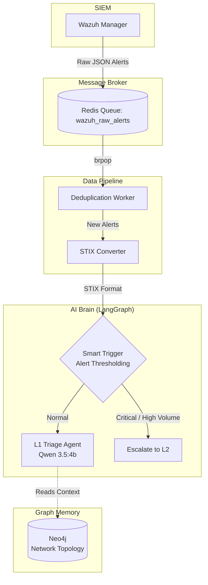

# 🛡️ Magister: AI-Powered SOC Analyst


**Magister** is an intelligent, automated L1 Security Operations Center (SOC) agent. It intercepts raw security alerts from Wazuh, deduplicates them, converts them into standard STIX format, and performs instantaneous L1 triage using a local LLM (Ollama) orchestrated by LangGraph. It also utilizes Neo4j to model the network topology and provide context to the AI.

## 🏗️ Architecture



## 🚀 Quick Start

### 1. Start Infrastructure
The project relies on Redis for queuing and Neo4j for graph memory. You can start them using the provided `docker-compose.yml` file:

```bash
docker-compose up -d
```

### 2. Install Dependencies
Create a virtual environment and install the required Python packages:

```bash
python -m venv venv
source venv/bin/activate  # On Windows use `venv\Scripts\activate`
pip install -r requirements.txt
```

### 3. Initialize Graph Database (Neo4j)
Load the initial network topology and access rules into Neo4j:

```bash
python neo4j/app.py
```

### 4. Run the AI Agent
Start the main deduplication and triage worker:

```bash
python main.py
```

## 📂 Project Structure

* `brain/`: The LangGraph AI agent logic, state management, and LLM configuration.
* `data_pipeline/`: Redis queue processing, deduplication logic, and STIX conversion.
* `neo4j/`: Scripts for building and managing the network topology in the graph database.
* `custom-ai-script.py`: The integration script placed on the Wazuh server to push alerts to Redis.
* `docker-compose.yml`: Infrastructure configuration for Redis and Neo4j.
