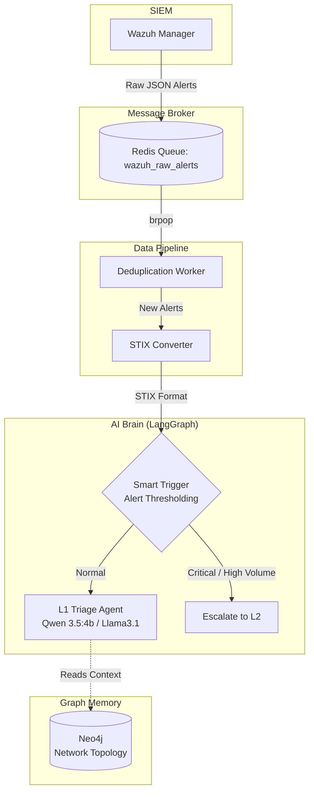

# 🛡️ Magister: AI-Powered SOC Analyst


**Magister** is an intelligent, automated L1 Security Operations Center (SOC) agent. It intercepts raw security alerts from Wazuh, deduplicates them, converts them into standard STIX format, and performs instantaneous L1 triage using a local LLM (Ollama) orchestrated by LangGraph. It also utilizes Neo4j to model the network topology and provide context to the AI.

## 📂 Project Structure

```text
Magister/
├── src/
│   ├── brain/              # LangGraph AI agent logic, state management
│   ├── data_pipeline/      # Redis queue processing, deduplication, STIX conversion
│   ├── neo4j_setup/        # Scripts for building network topology in Graph DB
│   └── main.py             # Entry point for the data pipeline
├── integrations/
│   └── wazuh_custom_script.py # Wazuh server script to push alerts to Redis
├── docker-compose.yml      # Infrastructure configuration (Redis & Neo4j)
└── requirements.txt        # Project dependencies
```

## 🏗️ Architecture



## 🚀 Quick Start

### 1. Prerequisites (Configuration)
Copy the configuration template and update it with your credentials:
```bash
cp .env.example .env
```

### 2. Start Infrastructure
The project relies on Redis for queuing and Neo4j for graph memory. You can start them using the provided `docker-compose.yml` file:

```bash
docker-compose up -d
```

### 3. Install Dependencies
Create a virtual environment and install the required Python packages:

```bash
python -m venv venv
source venv/bin/activate  # On Windows use `venv\Scripts\activate`
pip install -r requirements.txt
```

### 4. Initialize Graph Database (Neo4j)
Load the initial network topology and access rules into Neo4j:

```bash
python src/neo4j_setup/app.py
```

### 5. Run the Agents
Start the data deduplication pipeline:
```bash
python src/main.py
```
*(Optionally)* Start the AI Brain standalone:
```bash
python src/brain/main.py
```

## 🔌 Wazuh Integration
To forward alerts from Wazuh to the Redis broker, deploy the `integrations/wazuh_custom_script.py` script on your Wazuh Manager server. Ensure that the Python environment on the Wazuh server has the `redis` library installed.
